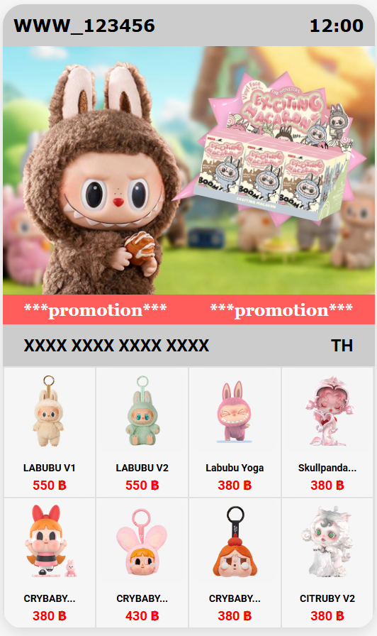
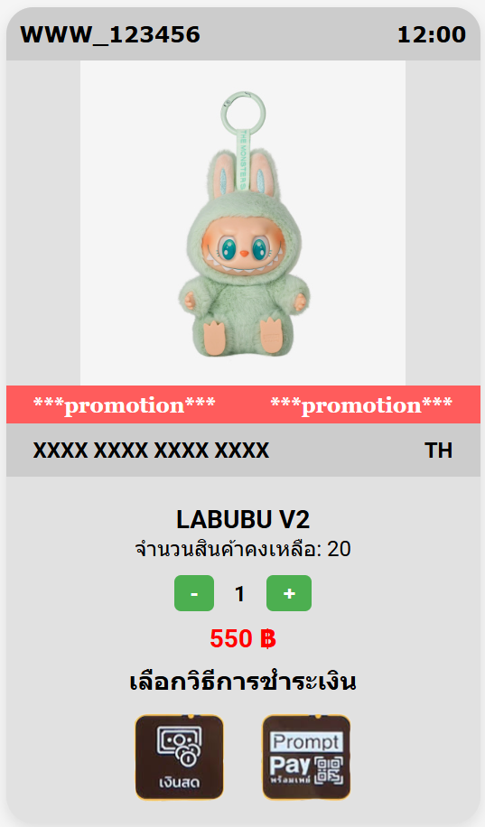
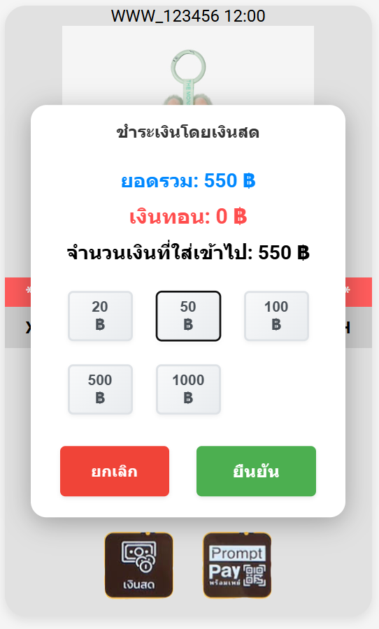
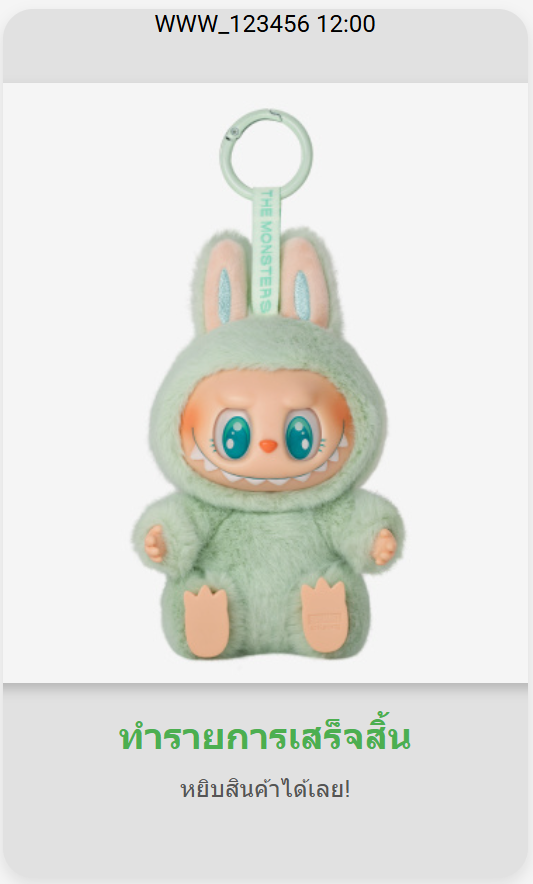

# โปรเจ็คส่วนตัว ปี 3 (2024)
# 🎁 SURPRISE BOX - Art Toy Vending Machine

> **Frontend เว็บแอปพลิเคชันตู้กดของเล่นอาร์ททอยที่จำลองประสบการณ์การซื้อสินค้าแบบเรียลไทม์**



[](https://github.com/Thoserrr/Surprise-Box)
[](#)
[](#)

## 📖 เกี่ยวกับโปรเจ็ค

**Surprise Box** เป็นเว็บแอปพลิเคชันที่จำลองประสบการณ์การใช้งานตู้กดสินค้าอาร์ททอย (Art Toy Vending Machine) ที่ออกแบบและพัฒนาขึ้นเพื่อแสดงทักษะด้าน **Frontend Development** และ **UI/UX Design** โดยเน้นการสร้างประสบการณ์ผู้ใช้ที่สมจริงและใกล้เคียงกับการใช้งานตู้กดจริง

### 🎯 จุดมุ่งหมายของโปรเจ็ค
- สร้างประสบการณ์การซื้อสินค้าออนไลน์ที่แปลกใหม่และน่าสนใจ
- จำลองการทำงานของตู้กดสินค้าจริงผ่านเว็บเบราว์เซอร์
- ฝึกฝนทักษะการพัฒนา Frontend และการออกแบบ UI/UX
- เรียนรูู้การจัดการสถานะของแอปพลิเคชันและการเก็บข้อมูลใน Local Storage

## 🎨 Design Process & UI/UX Highlights

### 🎯 User Research & Problem Statement
- **Target Users**: ผู้ที่สนใจซื้อของเล่นอาร์ททอย และผู้ที่ต้องการประสบการณ์การซื้อสินค้าแบบใหม่
- **Pain Points**: การซื้อสินค้าออนไลน์ที่น่าเบื่อ, ขาดความตื่นเต้นในการซื้อสินค้า
- **Solution**: สร้างประสบการณ์การซื้อสินค้าผ่านตู้กดเสมือนที่สนุกและน่าตื่นเต้น

### 🔄 User Journey & Flow
```
หน้าแรก (เลือกสินค้า) → หน้าชำระเงิน (เลือกวิธีการชำระ) → หน้าความสำเร็จ
```

## ✨ Features & User Experience

### 🏠 **หน้าแรก - Product Selection**
- **Vending Machine Interface**: หน้าจอที่จำลองตู้กดจริงพร้อม Header แสดง WiFi และเวลา
- **Product Display**: แสดงสินค้าอาร์ททอยหลากหลายชนิด (LABUBU, Skullpanda, CRYBABY, CITRUBY)
- **Promotion Banner**: แถบโปรโมชั่นเลื่อนแสดงข้อเสนอพิเศษ
- **Interactive Selection**: คลิกเลือกสินค้าได้ทันที พร้อมแสดงราคาชัดเจน

### 💳 **หน้าชำระเงิน - Payment Flow**
- **Product Summary**: แสดงรายละเอียดสินค้าที่เลือก ราคา และจำนวนคงเหลือ
- **Quantity Selector**: เลือกจำนวนสินค้าที่ต้องการซื้อ (มีการตรวจสอบสต็อก)
- **Payment Options**: 
  - 💵 **เงินสด (Cash)**: การชำระแบบดั้งเดิม
  - 📱 **PromptPay**: สแกน QR Code เพื่อชำระเงิน
- **Real-time Validation**: ตรวจสอบจำนวนสินค้าคงเหลือแบบเรียลไทม์

### ✅ **หน้าความสำเร็จ - Success Page**
- **Order Confirmation**: ยืนยันการสั่งซื้อเสร็จสิ้น
- **Transaction Summary**: สรุปรายการสั่งซื้อและการชำระเงิน

### 🔧 **Advanced Features**
- **Local Storage Management**: จัดเก็บข้อมูลสินค้าและสถานะการสั่งซื้อ
- **Stock Management**: ระบบจัดการสต็อกสินค้าแบบเรียลไทม์
- **Error Handling**: จัดการกรณีข้อผิดพลาดและแสดงข้อความแจ้งเตือน
- **Responsive Design**: รองรับการใช้งานบนอุปกรณ์ทุกขนาด

## 🛠️ Technical Implementation

### 📋 Tech Stack
- **Frontend**: HTML5, CSS3, JavaScript (Vanilla)
- **Styling**: Custom CSS with Flexbox/Grid Layout
- **Data Storage**: Local Storage API
- **Assets**: Custom designed images and icons
- **Fonts**: Google Fonts (Roboto)

## 🎮 การใช้งาน (How to Use)

1. **เลือกสินค้า**: คลิกที่สินค้าที่ต้องการจากหน้าแรก
2. **ตรวจสอบรายการ**: ดูรายละเอียดสินค้า ราคา และจำนวนคงเหลือ
3. **เลือกจำนวน**: ปรับจำนวนสินค้าที่ต้องการซื้อ
4. **เลือกวิธีชำระ**: เลือกระหว่างเงินสดหรือ PromptPay
5. **ยืนยันการสั่งซื้อ**: ดำเนินการชำระเงินและรับการยืนยัน

## 📱 รูปภาพตัวอย่างการใช้งาน

### หน้าแรก - เลือกสินค้า



### หน้าชำระเงิน



### ชำระเงินสำเร็จ


## 🚀 การติดตั้งและรัน

1. Clone หรือ Download โปรเจ็ค
2. เปิดไฟล์ `index.html` ในเว็บเบราว์เซอร์
3. เริ่มใช้งานได้ทันที (ไม่ต้องติดตั้ง Server)
